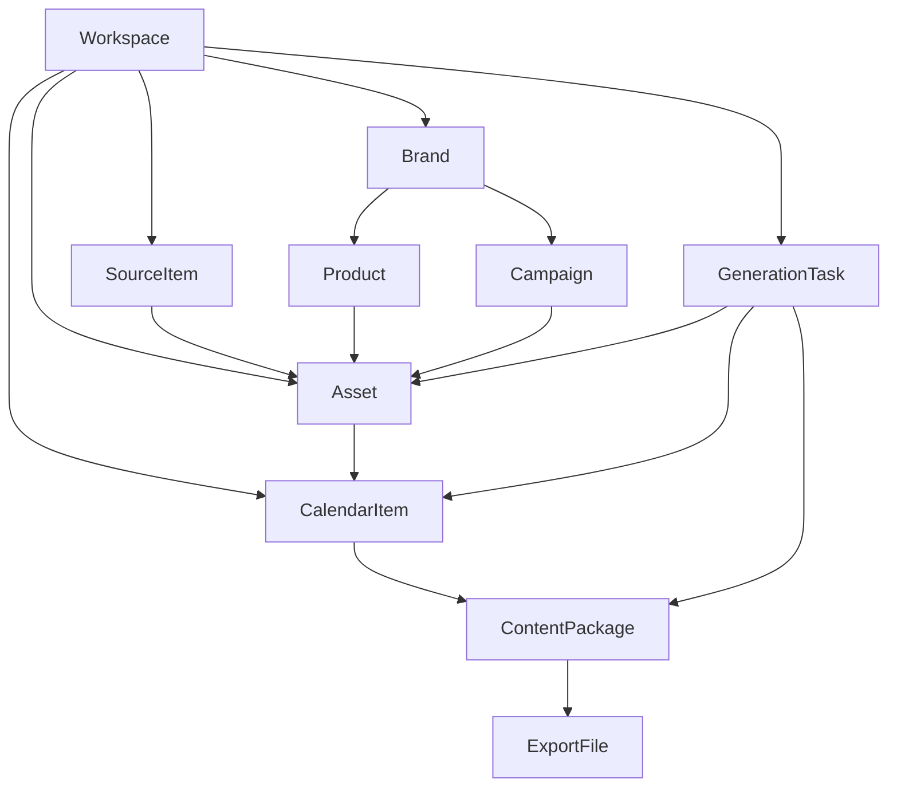
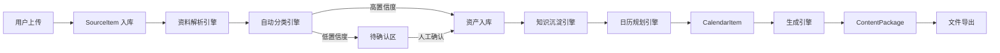

# 后台信息架构

本文档用于明确后台的对象边界、处理链路和模块职责，避免把系统做成“一个大模型接口 + 一个文件夹”。

## 1. 顶层领域模型

### 一级对象

1. Workspace
   一个品牌空间，对应一个租户隔离单元。
2. Brand
   品牌核心定义，包含定位、语气、边界、禁用规则。
3. Product
   品牌下的产品或服务单元。
4. Campaign
   活动、节点、上新、促销等有时间边界的营销事件。
5. Asset
   被系统沉淀后的结构化资产。
6. SourceItem
   用户上传或接入的原始资料。
7. CalendarItem
   日历上的一条内容计划。
8. ContentPackage
   针对单个日历项生成的一组内容物料。
9. GenerationTask
   一次 AI 解析、归类、规划、生成任务。
10. ExportFile
   导出的可下载文件。

### 对象关系图

---

## 2. 系统处理主链路

### 主链路

1. 用户上传原始资料。
2. 资料解析引擎生成结构化摘要。
3. 自动分类引擎决定进入品牌、产品、活动、素材或待确认区。
4. 知识沉淀引擎将有效信息写入资产层。
5. 日历规划引擎基于资产和时间节点生成内容计划。
6. 生成引擎为某个日历项产出内容包。
7. 文件导出引擎生成下载文件。

### 流程图

---

## 3. 核心模块职责

### A. 资料接入层

负责内容：

1. 文件上传
2. 文本粘贴
3. 外部链接录入
4. 外部文档同步

输入：

1. 文件二进制
2. 文本
3. URL

输出：

1. `source_items`
2. 原始文件引用
3. 基础元信息

### B. 资料解析引擎

负责内容：

1. OCR
2. 文本抽取
3. 文件元数据提取
4. 摘要与关键词抽取
5. 去重比对

输出：

1. 结构化摘要
2. 类型候选
3. 标签候选
4. 置信度

### C. 自动分类引擎

负责内容：

1. 判断对象归属
2. 识别是否涉及品牌核心定义
3. 判断能否自动入库
4. 低置信度回退待确认

核心规则：

1. 涉及品牌定位、语气、禁用表达的更新只能建议，不能自动覆盖。
2. 素材型资产允许在高置信度下自动入库。
3. 同一资料可同时关联多个对象，但要有主归类。

### D. 知识沉淀引擎

负责内容：

1. 把零散资料转成结构化资产。
2. 建立资产间关系。
3. 形成规则卡、FAQ、卖点、使用场景等可调用片段。

输出对象：

1. brand assets
2. product assets
3. campaign assets
4. media assets
5. idea assets

### E. 日历规划引擎

负责内容：

1. 基于活动节点和平台偏好生成内容计划。
2. 按素材可用性和目标频率排期。
3. 对缺素材、缺活动信息的日期做提醒。

输入依赖：

1. 品牌规则
2. 产品资产
3. 活动资产
4. 素材库存
5. 平台策略

输出：

1. `calendar_items`
2. 缺口提醒
3. 主题建议

### F. 生成引擎

负责内容：

1. 生成标题候选
2. 生成正文
3. 生成海报文案
4. 生成视频脚本
5. 生成多平台改写版本

关键约束：

1. 必须引用品牌规则和禁用表达。
2. 必须记录输入资产快照，保证结果可追溯。
3. 重新生成不能覆盖历史版本，而应产生新版本。

### G. 文件导出引擎

负责内容：

1. 生成 md
2. 生成 docx
3. 生成 pdf
4. 生成 txt
5. 打包说明文件

---

## 4. 资产分层设计

### L0 原始层

1. 原始文件
2. 原始文本
3. 链接抓取结果

特点：

1. 只追加，不覆盖。
2. 永远保留来源和上传者。

### L1 解析层

1. 摘要
2. 类型识别
3. 标签候选
4. 去重结果

特点：

1. 可重跑。
2. 允许模型升级后重新生成。

### L2 结构化资产层

1. 品牌资产
2. 产品资产
3. 活动资产
4. 素材资产

特点：

1. 供日历和生成直接调用。
2. 保留人工确认和系统建议的区分。

### L3 计划与生成层

1. 日历计划
2. 内容包
3. 导出文件

特点：

1. 面向用户交付。
2. 强状态管理。

---

## 5. 状态流转

### SourceItem 状态

1. uploaded
2. parsing
3. parsed
4. classified
5. needs_confirmation
6. archived
7. failed

### Asset 状态

1. draft
2. active
3. pending_confirmation
4. deprecated

### CalendarItem 状态

1. draft
2. waiting_assets
3. ready
4. generated
5. approved
6. published
7. skipped

### ContentPackage 状态

1. generating
2. generated
3. failed
4. exported

---

## 6. 权限和隔离

### 角色建议

1. Owner
2. Admin
3. Editor
4. Viewer

### 权限边界

1. 只有 Owner 和 Admin 可以修改品牌核心规则。
2. Editor 可以上传资料、确认资产、生成内容。
3. Viewer 只能查看资产、日历和已生成物料。
4. 所有对象默认按 workspace 隔离。

---

## 7. 后端服务切分建议

### MVP 可先做成 4 个模块

1. `workspace-brand`
   管品牌初始化、规则、团队与设置。
2. `ingestion-assets`
   管资料接入、解析、分类、资产沉淀。
3. `calendar-planning`
   管内容规划、缺口提醒、日历状态。
4. `generation-export`
   管内容生成、版本、导出文件。

### 异步任务建议

以下流程建议走队列而不是同步请求：

1. 大文件解析
2. OCR 和视频转写
3. 自动分类
4. 日历批量排期
5. 内容包生成
6. 文件导出

---

## 8. MVP 非功能要求

1. 所有 AI 生成结果保留 prompt 输入摘要和引用资产快照。
2. 所有关键操作保留审计日志。
3. 同一品牌空间内上传资料后，5 分钟内应完成识别和入库反馈。
4. 单日内容包生成需要支持失败重试。
